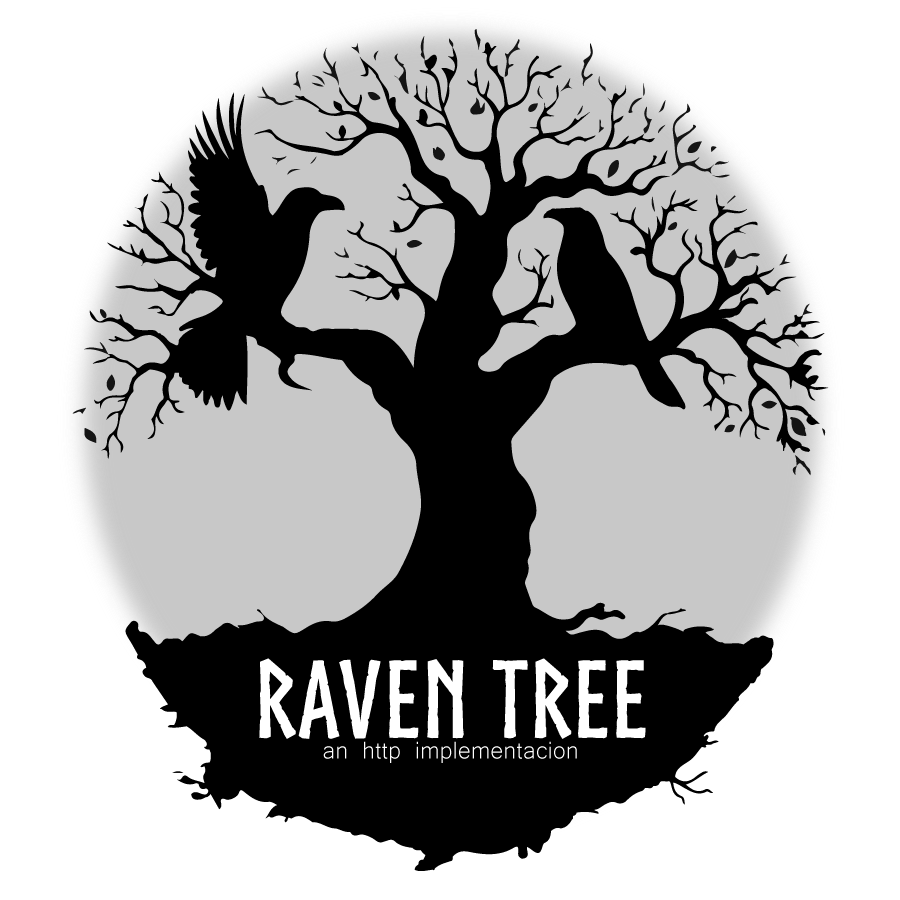

# Raven Tree

---
<p align="center"></p>

<p align="center">
<a href="https://github.com/AndresXLP/ravenTree/releases/latest"></a>
<a href="https://github.com/AndresXLP/ravenTree/actions/workflows/CI.yml"></a>
<a href='https://coveralls.io/github/AndresXLP/ravenTree?branch=main'></a>
<a href="https://github.com/AndresXLP/ravenTree/blob/main/LICENSE"> </a>
<a href="https://github.com/AndresXLP/ravenTree/actions/workflows/CI.yml"> <img src="https://img.shields.io/badge/Golang_CI-pass-green?logo=data%3Aimage%2Fpng%3Bbase64%2CiVBORw0KGgoAAAANSUhEUgAAAEoAAABRCAYAAAB1wTApAAAAGXRFWHRTb2Z0d2FyZQBBZG9iZSBJbWFnZVJlYWR5ccllPAAADp1JREFUeNrsXAtwVNUZ%2FklCNgEhKyQGFJsEEoKCSbDKQ8dko6JGgQgWaX00ZCo602rBPmynM23EPqYqbUlpO1UUEF9NVV5qA0SHTRwhCWB2w0MSlGyMBGIANyEvEGv%2F7%2Bw9693du3fvJpuQjf1nztzN7s3Ze777%2Ff%2F5%2Fv%2BcvcNoEFniE6uy%2BGDmlqw0b3MoTbxu%2Bc1yx0Bd27ALCAhapnL0AWZc%2FFiKiY52%2F%2B0808HtDPkBz8bNzs3K4FnDFigGBiy5k1s%2BNwtYE2OKpnFjxwpA4kaNEq%2FNoy7iNspQn47m4%2BLYyEcA6FCOwJTbZm5bGLTNYQEUAwRQCrgtwd9TUpIp6dLxlMwNwITaJGB1jkY63OCQbFvBgK0flEApABWBPQAlM32yAEntSv1tAM1ed4Qq9%2B%2BnnrPnAFih2i35Gr3d3cafO0MKlOpLPDpXXOwvYBAAuvX62f3CnGCs59w52v7%2BbrLV1ePPVUosK%2FIzWYB5j2oBNixIcIqUWGP2CqYvKAF1HccYc35ujnCvwWSHHQ7asrMc7BJxMOeaq0VMlAb2KWBiPAsYLFvQQDFIy8EUBOApycmUGD9GMOXEqVMimB5uaBTnZbGLgUUD6WK4BgweJicIvXMBVmZ6Gs26aprm5y9sfRv9gVHT1fJjmFGQpqQkEZjiDQKo%2Fcxrm2hmxjTNL%2FeepaT1hXHoq2r%2FAWZJo%2BbnU5KTaCZfi9Z3uK53I9%2FQWeI8HbAgNXINAaXonRowJT83W%2FNL0SkuCud4m43pbK%2Bv9wHJyID8xRswAgBdlzSBFmdewcfL6PK40eLzgy2tdKDlJJXYP6RdjZ%2BK%2FrVuLsAo2VYm3K%2BNg34iSxQ1aOV7PyArN4VVNiNAbWJ%2FvvOhRQs03WnLzgpxxMV43%2FEt1gox82AweZMniQGNjjGJz5va2nkgx9wDAlCLb52j67LyTieMiKHieXNEf3qG%2Fgtfe4tiR15EBfPv8OkbMQtgSVt82xw3WLghT67dQIq0eBwvIgOIxPVZUyZ7dPD8pq30dsX7AnXAfO8deT4sKtlRRrkpE%2BjVe%2FJpccaVlBp%2FMZmiotznxDFg0xITFEZMoH%2Fts9NBjnPTUidRVGSktru8volSL46j%2FxTeLfoLZJebR9ONk5Lo5b12OnbylOhbbfFmM7WcOk0nna4JrrOr2%2B0VuAZosY6ubmfnzm0leC9C57vgdpSuomRV7QE6wV8qTZtJ5QKAdYvmul1Cz8CMPQ8voe7ODuFWWob3waSN9y90s9KITeWbAfbBVcFIb7v1ulnu14ixalMY6J7dI4IJoibT1%2FQF%2Bt4zDNwNDMHFBWMYPIDFgLzjGQaI99FnMCBJuy19omBv1f6DPp9BJmAcaN6BXbmOcsNAgfZqcDD7wRAIPX2%2BUcSk4vk392omA7MAsr3%2BiMf70DcYqIxJJbWHaOGLb9CyN8tErDNiYLi%2FCQXj8P4M4UO%2BDAiUIveddQ2NHnRMZx2FdMQ7eYWewoDgbu09Z8Vgxv2umNJX%2FlMMzojl8d1XcjQPRoEVsJUVVbRsa5mYAErsh%2BjmNa%2BI7zLign4qD2Ic0F%2FSNXHcvmu3TGk2G2VUMdSqCmEOcg4h2LRmJTkg3G0MBtbGA8HgjNx9DEjNYNEvx0QEZskmtaHv0vqPg0pntGVKMsffg2KcKsFZqD5HFyhlarQhmGKWQ00INEXHelZa53vxkAK9sRiTyc2aJme7in2TBIObnGeM9%2BVHfqCiAUIoKY5VrZ%2BkRRnoH%2Bq0iAXYcogwuF0w9uCM6YJNcTG9S2uQj0mAAI68CXgP%2FeYpLNazQGxWCd71DFCh1jkBgzkyaW6PAmWJvj9fh8hzBc8r3e8%2FW10jBndb%2BqSAA4Ky9o59kCel9UfF659lz3S74QE%2BFxoN7hrItvH3a6UrwaRUUUHcXKdehxhQyXZXLPrtnGz3BSK4iwEa0FTPVtt8%2Boebb99VKQI5%2BtnzcKGIfwDMSJ%2B4eaV1RynfkhMAqEsRVrJCAZTwOX%2FZOe4Y2LCmykZP3JLt0lJB6Kk1DBLcaeHtt%2Fu4noWncAAFN5sqpMIEQ32CoUhjAH6WxgTkkYnEj3GL7F65nsosqG%2FrGZQuWFFSG1zgxvm%2F3lEhAFHXiNxa59tXCw238MWNAlCjfeJ85HrIIwOZJIBSCOgTowLWmcAqDAhyADPV0hlZAfsEU9DwfwDEJfjqqfG4e7FAaDfchHL%2BfgAKV3Il2xM91Hq7kAtH3ck2yj4QlEbqY6rYaO4rUDlGVkjyLdmCFRgQ2PUggwVVrQ66cAkMBoNq7eoRIMha1jOvb%2FTJyyBJyvfuo2X3fk%2BUZcr3fSBuxjIlwUbf6LNNkREA%2FaHvLAi6DA2PYd2Ger%2B1T4wyupQEZmROniwG9HtrpabQQ19g4EIeuHS3yv0HNJNXKRZRrEPfuBloABDME4WjhEsoafx4n%2FXAUHlMFPXBTjvbxHGMOU5T%2F8gBqcu1EiR1LJJpg798TJqVWQWlLotxycrSV6gM4pZci7KhA6qW48hLW98Ur%2B%2BbP48yNCqc3oFSU3NwHHph61tCyBbMu1qAhkxfxicAgs9k%2FEIZp%2FjlV6lg%2FtyQr%2FCgP841zSEB6khjI5WWv0fdPT303Xlz6fjnTnrlrbfJWlVNeTk3UFpSUlD9wT3BCjBP6jS92nvBvDtEOQfgImYN1EJGQKAiH%2FkVELacOdOevGnHDhofH0%2BWmTNoZmYGnf3iCzrf%2BAndnpdHDgbweQ7EpujhzK50wbAJiYkUGxOjv4zU4PApABqZMBxi9cehWavvo2kzioGAkFzi9X4cqTZPgCVpHHivUgavqUb5HDSn00nNHGBfLd1Ora2tIn6NjTPTZeMSaYQXaHnZN%2FjN6I3kgG0dHSFFSE90glHJfNeLcpkl0sbExYkBgg3%2BgPE7ALNZtCuvuEKpRXdRV2enOLa2nvxaIhw6JIACI1CZgMvBjVAAlHsHJIiYHaGlpLoGm9ACpSXBz3omfdcDGLjo%2FrCRI0aI5p26AiiXmp%2FNOeIOenLdBvfCAxLo8SmXi2R64%2F13cc7IIrKyUsyMmDER8AGSUbkyIDGqvw0sKuBJASB0fNZC7yy9x63YARTyOpnbbf34EwFsMNuDBgVQ585%2FGVINE6GzeIBUBSXbC7WnIaIv%2F%2Fzfr74KXSAdO0bkZ0Zq4GEHVCgN9SC4IfJD1LS2KZVM1MkBHnK5C2lRgwUogIT4s5KV98qKSqGSZSViGZWJz4PVW0MSKJn1I6lFXihjEaoFyO8GesdeyIBCCtPQ1ESn29tpxMiLQppvef99oXftBQQKYGilIFX2WnpjRxmNS4in1tOfUyzrpOtnz6bhw4d7nPcFpzgw7%2FfD0fwG809bWuixp%2F8kjt5JMaoGOTOupR8sWkS33HgjdbPqfn%2F3bp8%2B9uzdK9pQML9AQa0jx1vz79fcdScYQLrrljk0kpn257VrqWrfPsrIyBDsQWIs7dCHH9Kx5mZKS00NO1CUXc3GXQ91pj%2BueY6KVv9N5H4y77MoeWH32bMUzQmvdC273S7AQmIM4JAkJyQkDAlG6QIFcJ76%2BU%2BF%2B33EierO6mqalelZAOzkhBdJ8GWsg%2BBmCRyvwCK8hxxvqJihWQ9MQkNVMzXpW5oBW1YOLmXAANpQs6CUOQK5XtnlEnaztra2sAVDtW6Z5b2%2BF3QKE6hiGc6mErT49UUNg9XA7XFDrgd3Qz3cqCGQWysqvlbbPCPCJcPJsIsYW5zsdfXJjubjRQxWvi6jIAvkSgtKuUYMMyBcEA3xC6Cp41i4uCCqqQBMbL02RWfpAgWQYmNM9OPv3ye0E9zOW4BqzYAoA6NZsl0rK7KaGRbuh22Kqp3PclVIV5kjeENLqWc%2Ftfj0cTsO5Oa4OA92XXvNNXTko49EzTws2MR5pazVw%2F2wlQlbFnWV%2BYpHHnav05VWvCfAq62r0zwf7oX4dJAVOVZfpEEq3Dl%2FflhpKvyiodz1Ew9R2sFibEDBCXvy2ecESFDkSIi1kmWwJkEVl67jJFnqqTBMip3WvR%2BYld%2FDiL8DygO4H0D6xYMPiDgFplmr93i4F8CpP3KEpnJcmnPTTQIg5HphKRFc%2Bw%2BwCSuFG7ZkruA23ZA8kMpcnf%2FFujoUsWcPJ8bqvC6JX%2B%2FavVsAGG5sUvYfkPJbvVWGU5hjJ1rE8rnaHTELbuQgB7YBiMlpae4FTxmX8D5i1jciKYYBFK1Aj%2FfburqprrmZZwlfnYQA%2Fo3N9b5BZv4%2FUAEszrXBLUsLKBvHGiem%2FYEySInBmlz7W6qP%2BHL1H7DRPpfTFRsWDPrbUNw7eeIEi9kfhV%2BMYrCgG3KtVdU25HcQlKE2SIWyd9%2BlRGXWDLdyjTtGgVncprMLrv%2FrhpdCChZkQtk774gFTuiwcKxp%2BQRzBquQlfijRav%2FrlspMGpYiUFKs%2BDmm4SyH1LygMFaxYxasHrDS7pBPmKY%2FvMlsCJTU1NDPyks8BCtQ0pHMVibu3p6EOSd%2Fiqc0VGRukH7eFMT%2FXLpA0Fvb7yg2bCfn9Tq6iglyKfwbGiTlU61aW0kk9WD0UrBT2uz%2FmC2tjNiA60jaMEp5cOBow2Op55b6xHkvTeSyXr51IkptPTuReG8EBE8UBKs2NgRjk7O6Z5%2Bfp1mkEexDiDNzb4hrIN2z7mzfc%2F1IiIjRVCGfKh1PWvJHbSrqquHRNBW6uW2oKsHKsNTJSzpEyfS1LRUAVb2zBnU8Okx6uroEEE73OKRNqPOybH2mlFWUn5XjFkMwBw8XEdfnT8flkHb36THjMrVetpiUM%2B4S%2FxtsfmxJffXxJpMyUOwcAB3K%2FzhJSM1f4sb9MMA%2F%2FFZJ2o1eNbd8iECELykmAF6XO%2BkXj9ekgEDq9aR6wGk4Wrrua1gkByBTuzzczgZMIvCMMtQBChkQKkAQ1UQv4deMohdbHOwAIUcKK8YBrDw6NusQQAQZms8J3QzA%2BTsbSf9%2BqxgJY6pH6Y8kOBsUcBxhKLDAXtMt8I0i8KyHOVoDpFL2RSRaGVgrP1x%2Ff8TYABsY9SiQaZy%2FgAAAABJRU5ErkJggg%3D%3D"></a>
<a href="https://goreportcard.com/report/github.com/AndresXLP/ravenTree"> </a>
</p>

---
Is a lightweight Go library designed to simplify HTTP requests by providing an easy-to-use interface, built-in support
for various HTTP methods, accepting retry handling, and more.

## Installation

To use can install it via `go get`:

```bash
go get github.com/AndresXLP/ravenTree
```

---

## Usage

```go 
package main

import (
  "context"
  "fmt"
  "log"
  "net/http"
  "time"

  "github.com/AndresXLP/ravenTree"
)

func main() {
  tree := ravenTree.NewRavensTree()

  options := &ravenTree.Options{
    Host:        "http://localhost:8080",
    Path:        "/api/resource",
    Method:      http.MethodGet,
    QueryParams: map[string]string{"code": "123"},
    Headers:     map[string]string{"Authorization": "Bearer 1234"},
    Timeout:     5 * time.Second,
    RetryCount:  3,
    Backoff: ravenTree.NewBackoff(
      ravenTree.WithStrategy(ravenTree.Exponential),
      ravenTree.WithBackoffDelay(3*time.Second),
      ravenTree.WithMaxDelay(10*time.Second),
    ),
  }

  resp, err := tree.SendRaven(context.Background(), options)
  if err != nil {
    log.Fatal(err)
  }

  fmt.Println(resp.ParseBodyToString())
}

```

---

### Methods Provided

SendRaven: This method sends an HTTP request based on the provided Options. It supports different HTTP methods such as
GET, POST, PUT, DELETE, etc.

### Body Management

The Body field in the Options struct can accept any type of data that can be marshaled into JSON. The library
automatically handles the marshaling of the Body when sending the request.

### Headers and Query Parameters

By default, the ***Content-Type*** header is set to ***application/json***.

You can add additional headers and query parameters using the **Headers** and **QueryParams** fields in the Options
struct.

### Timeout and Retry Options

- **Timeout**: Specifies the maximum duration for a request. If the request takes longer than this duration, it will be
  aborted, and an error will be returned.
  </br></br>
- **RetryCount**: Specifies the number of times to retry the request if it fails. This is useful for handling transient
  errors or network issues. The library will automatically retry the request up to the specified number of attempts.
  </br></br>

### Backoff Options

The `Backoff` struct defines the strategy for implementing backoff delays in retry operations with the following fields:

- **BackoffDelay**: Specifies the duration to wait before the next retry.
- **MaxDelay**: Specifies the maximum duration for backoff delays.
- **Strategy**: Determines the type of backoff (Default, Linear, or Exponential).

### Creating a New Backoff

Use the `NewBackoff` function to create a new `Backoff` with optional parameters:

- If no options are provided, it defaults to:
    - `BackoffDelay`: 0 seconds
    - `MaxDelay`: 10 seconds
    - `Strategy`: Default
      </br></br>
- Note: If `MaxDelay` is set to a value less than `BackoffDelay`, `MaxDelay` will be updated to match `BackoffDelay` to ensure
  valid configuration.

### Example Usage

```go
package main

import (
	"time"

	"github.com/AndresXLP/ravenTree"
)

func main() {
	options := &ravenTree.Options{
		Backoff: ravenTree.NewBackoff(
			WithStrategy(Linear),
			WithBackoffDelay(2*time.Second),
			WithMaxDelay(30*time.Second),
		),
	}

}

```

### Error Handling

Always check for errors after calling SendRaven. If the request fails, the error will provide information about what
went wrong.

### Thematic Inspiration

The name **Raven Tree** reflects the connection to the mystical ravens that serve as messengers in both Game of Thrones
and Norse mythology, symbolizing communication, wisdom, and the passage of information.

Just as these ravens carry messages across great distances, **Raven Tree** aims to facilitate seamless communication
between your application and external APIs.

---

## Authors

- [@andresxlp](https://www.github.com/andresxlp)

---

### Contributing

Contributions are welcome! Please open an issue or submit a pull request for any features or fixes you want to add.

## License

The project is licensed under the [MIT License](https://choosealicense.com/licenses/mit/)
