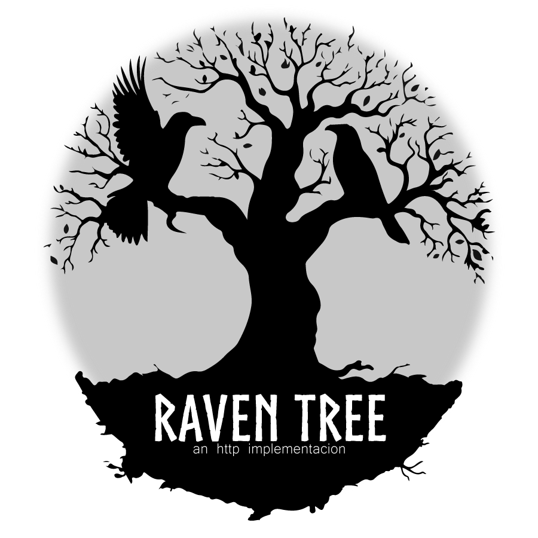

# Raven Tree

---
<p align="center"></p>

<p align="center">
<a href="https://github.com/AndresXLP/ravenTree/releases/latest"></a>
<a href="https://github.com/AndresXLP/ravenTree/actions/"></a>
<a href='https://coveralls.io/github/AndresXLP/ravenTree?branch=main'></a>
<a href="https://github.com/AndresXLP/ravenTree/blob/main/LICENSE"> </a>
</p>

---
Is a lightweight Go library designed to simplify HTTP requests by providing an easy-to-use interface, built-in support for various HTTP methods, accepting retry handling, and more.

## Installation

To use can install it via `go get`:

```bash
go get github.com/AndresXLP/ravenTree
```
---
## Usage

```go 
package main

import "github.com/AndresXLP/ravenTree"

func main() {
	tree := ravenTree.NewRavensTree()

	options := &ravenTree.Options{
		Host:        "http://localhost:8080",
		Path:        "/api/resource",
		Method:      http.MethodGet,
		QueryParams: map[string]string{"key": "value"},
		Headers:     map[string]string{"Authorization": "Bearer token"},
		Timeout:     5 * time.Second,
		RetryCount:  3,
	}

	response, err := tree.SendRaven(context.Background(), options)
	if err != nil {
		log.Fatal(err)
	}
}
```
---
### Methods Provided
SendRaven: This method sends an HTTP request based on the provided Options. It supports different HTTP methods such as GET, POST, PUT, DELETE, etc.

### Body Management
The Body field in the Options struct can accept any type of data that can be marshaled into JSON. The library automatically handles the marshaling of the Body when sending the request.

### Headers and Query Parameters
By default, the ***Content-Type*** header is set to ***application/json***.

You can add additional headers and query parameters using the **Headers** and **QueryParams** fields in the Options struct.

### Timeout and Retry Options
- **Timeout**: Specifies the maximum duration for a request. If the request takes longer than this duration, it will be aborted, and an error will be returned.
  </br></br>
- **RetryCount**: Specifies the number of times to retry the request if it fails. This is useful for handling transient errors or network issues. The library will automatically retry the request up to the specified number of attempts.

### Error Handling
Always check for errors after calling SendRaven. If the request fails, the error will provide information about what went wrong.

### Thematic Inspiration
The name Raven **Tree reflects** the connection to the mystical ravens that serve as messengers in both Game of Thrones and Norse mythology, symbolizing communication, wisdom, and the passage of information.

Just as these ravens carry messages across great distances, **Raven Tree** aims to facilitate seamless communication between your application and external APIs.

---
## Package Dependency

Raven Tree depends on <a href="https://github.com/gojek/heimdall" >
 Heimdall
</a>, a powerful HTTP client that provides features like timeouts and retries, making it an essential component for managing HTTP requests in a robust and resilient manner.

---

## Authors

- [@andresxlp](https://www.github.com/andresxlp)

---
### Contributing
Contributions are welcome! Please open an issue or submit a pull request for any features or fixes you want to add.

## License

The project is licensed under the [MIT License](https://choosealicense.com/licenses/mit/)
